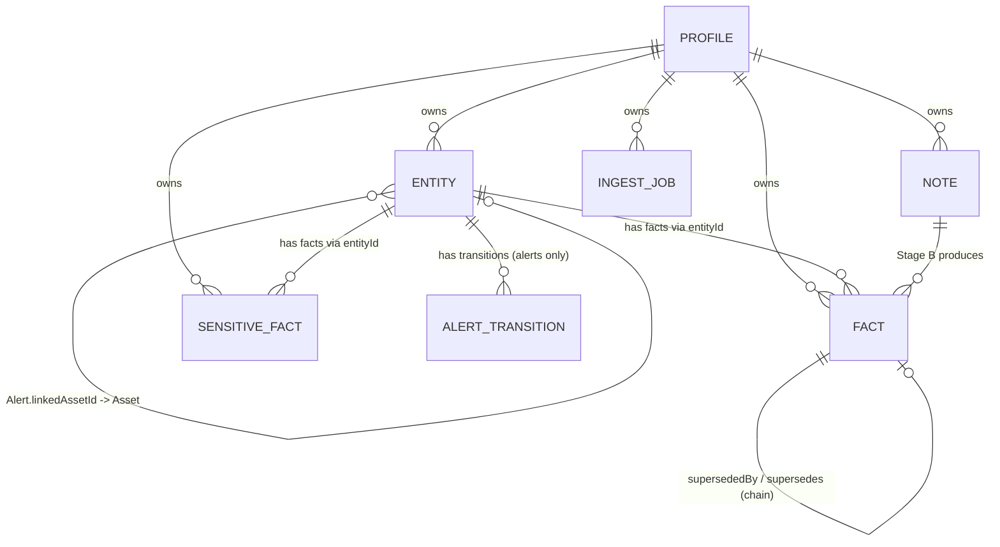

# Life Graph — Data Model & ERD

**Date:** 2026-04
**Author:** Kevin Patel (patelkev@yahooinc.com)
**Status:** Draft — Storage design. Locks in the concrete schemas the team builds against.
**Parents:**
- [2026-04-life-graph-strategy.md](./2026-04-life-graph-strategy.md) — R1–R10 requirements
- [2026-04-life-graph-ingest-pipeline-design.md](./2026-04-life-graph-ingest-pipeline-design.md) — pipeline lifecycle

---

## TL;DR

Five Firestore collections (and one subcollection) under `/users/{uid}/...`:

- **`profile`** — user config + backfill state.
- **`entities/{eid}`** — every typed node in the graph (Person, Org, Event, Commitment, LifeThread, Preference, Household, Asset, Alert, AlertRule, ExternalSystemAlert).
- **`entities/{eid}/transitions/{tid}`** — alert lifecycle history (subcollection; only on Alert-type entities).
- **`facts/{fid}`** — typed claims attached to entities, current and superseded.
- **`sensitiveFacts/{fid}`** — sensitive-zone facts, segregated for security-rules enforcement.
- **`notes/{nid}`** — Stage A free-form notes (the source-of-truth ingest output).
- **`ingestJobs/{jid}`** — cold-start backfill phases and warm-path batches.

Design priorities: minimum schemas to make the strategy and pipeline work, type-discriminated entities so new node types ship without migration, supersedes-via-status-flag so default queries stay cheap, sensitive facts physically separated so R8 is enforced at the storage layer.

---

## Database Choice — Firestore (Recommended)

Both Firestore and Firebase RTDB were on the table. **Recommendation: Firestore.** Rationale:

| Need (from pipeline doc)                                                                            | Firestore                        | RTDB                                                            |
| --------------------------------------------------------------------------------------------------- | -------------------------------- | --------------------------------------------------------------- |
| Compound queries (`type=event AND startTime in window`, `entityId=X AND slot=Y AND status=current`) | Native composite indexes         | Not supported — must denormalize or filter client-side          |
| Atomic supersedes-chain writes                                                                      | Multi-doc transactions           | Limited; tree-fanout transactions only                          |
| Per-collection access control (sensitive-zone gate, R8)                                             | Security rules per path          | Single-tree rules; harder to isolate sensitive subset           |
| Drawer-scoped reads (R6 packet assembly)                                                            | Indexed `where drawer=X AND ...` | Requires per-drawer subtrees + cross-tree joins client-side     |
| Read-heavy + complex query workload                                                                 | Optimized                        | Optimized for tree-shaped real-time sync, not query-heavy reads |

The graph is read-heavy with cross-drawer queries — the exact shape Firestore is designed for. RTDB would force denormalize-heavy JSON trees, client-side joins, and a parallel scheme to fan out the supersedes chain.

**If RTDB is mandated later** (e.g., for cost, or for tighter integration with an existing Firebase RTDB infra), the same logical model maps but requires:
- Explicit fan-out writes for every fact update (the current-fact-by-entity-by-slot tree mirrors the canonical fact tree).
- Loss of compound queries — replace with denormalized lookup nodes (`/by-entity-slot/{eid}/{slot}/current → factId`).
- Sensitive-zone gating moves to application-layer filtering, not security rules.

The schemas below are written for Firestore document semantics and Firestore's index model.

---

## Top-Level Layout

```
/users/{uid}
  profile                              # single doc — config + backfill state
  entities/{eid}                       # all typed nodes
    transitions/{tid}                  # subcollection — alert lifecycle history
  facts/{fid}                          # all non-sensitive facts (current + superseded)
  sensitiveFacts/{fid}                 # sensitive-zone facts
  notes/{nid}                          # Stage A free-form notes
  ingestJobs/{jid}                     # cold-start phases + warm-path batches
```

Everything is namespaced under `/users/{uid}/`. Single-account per user; multi-account is Approach C and out of scope here.

---

## Design Decisions (and Why)

1. **One `entities` collection with a `type` discriminator, not one collection per type.** Universal merge / identity-resolution / sensitivity-routing logic operates on a single collection. Adding a new entity type ships without schema migration. Hot type-specific fields are denormalized to top-level for query power; cold/rare fields live in `payload`.
2. **Supersedes via `status` field, not a separate `archivedFacts` collection.** `status ∈ {current, superseded}` plus a composite index on `(entityId, slot, status)` makes the default "give me the current value" query a single point lookup. The "what was the original time?" follow-up (R4 / Part 4 §10) flips to a status-agnostic read of the same collection — no cross-collection join.
3. **Sensitive facts in their own collection.** Default `wiki_agent` reads simply do not touch `sensitiveFacts/`. Firestore security rules enforce at the storage layer; HITL consent path explicitly opts in. Storing them inline with a `isSensitive` flag would put R8 on the honor system.
4. **AlertRule, Alert, ExternalSystemAlert are entity types**, not separate collections. Pipeline §3.5 explicitly calls alerts "first-class entities with a lifecycle." Same merge/identity rules apply. Lifecycle transitions live in a subcollection so the parent doc stays small.
5. **Sender classification is a fact**, not a separate dictionary. Pipeline §2.1: *"The dictionary is not a separate store — it is the set of `sender_class` facts on Person/Org entities."* No new collection; no new identity model.
6. **Relationships are facts**, not edges in a separate collection. `Person:user` carries fact `slot=parent_of, value={entityId: kidId}`. Cross-drawer traversal becomes `where entityId=X AND slot IN [...]` plus optional reverse-edge facts on the other end for bidirectional lookup. Firestore is not a graph DB; this models traversal as bounded query hops.
7. **Free-form notes are independent of facts.** `notes/` is the source of truth; `facts/` is a derived view. Schema migration re-runs Stage B over notes (per pipeline Part 1 §2). Don't conflate the two by stuffing notes into `facts.value`.

---

## Schemas

TypeScript-style interfaces. Field names are camelCase. `Timestamp` is Firestore's `Timestamp` type. `Ref<T>` is a string document ID (Firestore ref). All collections are under `/users/{uid}/...`.

### `profile` (single doc)

```ts
interface Profile {
  uid: string;
  email: string;
  timezone: string;                    // IANA tz, used for digest cron + "today" boundaries
  backfillWindowMonths: 1 | 3 | 6 | 12;
  backfillStatus: {
    phase: 0 | 1 | 2 | 3 | 4;
    progress: number;                  // 0..1
    completedAt: Timestamp | null;
    costSpent: number;                 // running cost in dollars
  };
  pinnedEntityIds: Ref<Entity>[];      // R7 user-pin override
  consentScope: {                      // R8 — per-purpose sensitive-zone consent
    digest: 'never' | 'session' | 'always';
    triage: 'never' | 'session' | 'always';
    reply:  'never' | 'session' | 'always';
  };
  digestLastDeliveredAt: Timestamp | null;
}
```

### `entities/{eid}`

Common fields on every entity, plus type-specific denormalized hot fields. Cold fields live in `payload`.

```ts
type EntityType =
  | 'person' | 'organization' | 'household'
  | 'life_thread'
  | 'event' | 'commitment' | 'preference'
  | 'asset'
  | 'alert' | 'alert_rule' | 'external_system_alert';

type Drawer =
  | 'people_orgs'           // R2 drawer 1
  | 'life_threads'          // R2 drawer 2
  | 'commitments'           // R2 drawer 3
  | 'top_of_mind_prefs';    // R2 drawer 4

interface Entity {
  id: string;
  type: EntityType;
  drawer: Drawer;
  label: string;
  aliases: string[];
  emailAddresses: string[];            // for Person/Org — empty otherwise
  sourceMessageIds: string[];          // grounding (R1)
  firstSeen: Timestamp;
  lastUpdated: Timestamp;
  pinned: boolean;
  pinnedAt: Timestamp | null;

  // Decay (R7) — optional, used for top-of-mind items
  entryClock: Timestamp | null;        // when this becomes top-of-mind eligible
  decayClock: Timestamp | null;        // when this falls out of top-of-mind

  // Type-specific hot fields (only populated when relevant to the type)
  relationshipClass?:                  // Person/Org
    | 'family' | 'work' | 'school' | 'doctor' | 'vendor'
    | 'service' | 'newsletter' | 'unknown';
  startTime?: Timestamp;               // Event
  endTime?: Timestamp;                 // Event
  participantIds?: Ref<Entity>[];      // Event / LifeThread
  dueDate?: Timestamp;                 // Commitment
  resolvedAt?: Timestamp | null;       // Commitment — null while open
  owedBy?: Ref<Entity>;                // Commitment
  owedTo?: Ref<Entity>;                // Commitment
  lifeThreadStatus?: 'active' | 'upcoming' | 'dormant' | 'closed';  // LifeThread
  lastActivityAt?: Timestamp;          // LifeThread

  // Alert-specific (when type === 'alert' | 'external_system_alert')
  alertType?:
    | 'preference_conflict' | 'schedule_conflict' | 'deadline_risk'
    | 'waiting_on' | 'subscription_change' | 'security' | 'service_outage';
  severity?: 'critical' | 'high' | 'medium' | 'low';
  state?: 'new' | 'surfaced' | 'snoozed' | 'acknowledged'
        | 'dismissed' | 'resolved' | 'auto_resolved';
  snoozedUntil?: Timestamp | null;
  category?: string;                   // for digest coalescing
  cascadeId?: string | null;
  cascadePosition?:
    | '14d_before' | '7d_before' | '2d_before' | 'day_of' | 'day_after' | null;
  triggeringFactIds?: Ref<Fact>[];
  triggeringEntityIds?: Ref<Entity>[];
  alertRuleId?: Ref<Entity> | null;    // points to an AlertRule entity
  summary?: string;
  suggestedActions?: string[];

  // ExternalSystemAlert (extends Alert)
  sourceSystem?: 'google_cloud' | 'github' | 'aws' | 'bank' | 'regulator' | string;
  externalId?: string;                 // e.g. CVE-2026-1234
  linkedAssetId?: Ref<Entity>;         // Asset entity
  recommendedAction?: string;

  // AlertRule-specific (when type === 'alert_rule')
  ruleScope?: { targetEntityId: Ref<Entity>; contentMatch: string };
  ruleDefaultAction?: 'suppress' | 'surface';
  ruleExceptions?: { field: string; condition: string; threshold: unknown }[];
  ruleSafetyOverrides?: string[];
  ruleBaseline?: {
    fields: Record<string, unknown>;
    computedFromMsgIds: string[];
    lastUpdated: Timestamp;
  };
  ruleStatus?: 'pending' | 'active' | 'disabled';

  payload: Record<string, unknown>;    // type-specific cold fields, never-queried extras
  schemaVersion: number;               // bump when shape changes; backfill via Stage B re-run
}
```

### `entities/{eid}/transitions/{tid}` (alerts only)

Subcollection — each alert lifecycle transition. Subcollection rather than embedded array so the parent doc stays small as history grows.

```ts
interface AlertTransition {
  id: string;
  state: Entity['state'];               // the state being entered
  at: Timestamp;
  actor: 'user' | 'system';
  reason?: string;                      // for dismiss/auto_resolved
  snoozeDuration?: string;              // e.g. "7d", "until 2026-05-03"
}
```

### `facts/{fid}`

```ts
type FactType = 'stable' | 'time_sensitive' | 'reminder' | 'relationship';
type Authority = 'explicit_remember' | 'correction' | 'ambient' | 'email_derived';
// authority order on conflict (R5): explicit_remember > correction > ambient > email_derived

interface Fact {
  id: string;
  entityId: Ref<Entity>;
  slot: string;                         // e.g. 'job', 'meeting.time', 'food_preference', 'parent_of', 'sender_class'
  factType: FactType;
  value: unknown;                       // typed payload — schema depends on slot
  status: 'current' | 'superseded';
  authority: Authority;
  confidence: number;                   // 0..1
  sourceMessageIds: string[];
  firstSeen: Timestamp;
  lastVerified: Timestamp;
  effectiveTime: Timestamp;             // source email's delivery time — pipeline shared invariant
  supersededBy: Ref<Fact> | null;       // newer fact that replaced this one
  supersedes:   Ref<Fact> | null;       // older fact this one replaced
  drawer: Drawer;                       // denormalized from the entity for drawer-scoped queries
}
```

**Slot conventions:**
- Stable: `home_address`, `birthday`, `food_preference`, `school_name`, `job`, `sender_class`.
- Time-sensitive: `meeting.time`, `meeting.location`, `flight.time`, `deadline.date`.
- Reminder: not a real slot — appended to an existing fact's `sourceMessageIds[]`, no new fact created.
- Relationship: `parent_of`, `spouse_of`, `employs`, `attends`, `vendor_for`. `value = { entityId: Ref<Entity> }`.

### `sensitiveFacts/{fid}`

Same shape as `Fact` plus a sensitivity classifier. Lives in its own collection so security rules can reject default reads.

```ts
type SensitivityClass =
  | 'financial' | 'health' | 'credentials'
  | 'minor_location' | 'political_religious' | 'gov_id';

interface SensitiveFact extends Fact {
  sensitivityClass: SensitivityClass;
}
```

### `notes/{nid}`

Stage A free-form notes — the source-of-truth output of every ingest. Stage B reads these to produce facts.

```ts
interface Note {
  id: string;                           // == sourceMessageId
  sourceMessageId: string;
  deliveryTime: Timestamp;              // pipeline shared invariant
  from: { name: string; email: string };
  subject: string;
  notesText: string;                    // prose — what Stage A saw
  signals: string[];                    // e.g. 'meeting_reschedule', 'work_context'
  contentTier: 'skip' | 'direct_to_schema' | 'two_stage';
  stageBStatus: 'pending' | 'processed' | 'failed';
  stageBProcessedAt: Timestamp | null;
  producedFactIds: Ref<Fact>[];         // facts this note produced (back-ref for audit)
}
```

### `ingestJobs/{jid}`

```ts
interface IngestJob {
  id: string;
  kind: 'cold_start' | 'warm_batch' | 'retroactive_boost' | 'manual';
  phase: 0 | 1 | 2 | 3 | 4;             // applies to cold_start; for others: 0
  windowStart: Timestamp;
  windowEnd: Timestamp;
  costBudget: number;                   // hard cap in dollars
  costSpent: number;
  status: 'pending' | 'running' | 'completed' | 'failed' | 'capped';
  errorCount: number;
  processedMessageIds: string[];
  createdAt: Timestamp;
  completedAt: Timestamp | null;
}
```

---

## ERD Diagram



---

## Drawer ↔ Entity Type Map

R2 drawer membership is stored explicitly on each entity (denormalized so drawer-scoped queries are one indexed read).

| Drawer | Entity types |
|---|---|
| `people_orgs` | Person, Organization, Household |
| `life_threads` | LifeThread |
| `commitments` | Event, Commitment |
| `top_of_mind_prefs` | Preference, plus Event/Commitment when their `entryClock` has fired but `decayClock` has not. Top-of-mind is a *view*, not a separate drawer membership — entities can be drawer-routed by their type but appear in the top-of-mind packet via the `entryClock < now < decayClock` query. |

Alert-family entities (Alert, AlertRule, ExternalSystemAlert) are not drawer-membership concerns — they're consumer outputs of the reasoning pass and are queried by `type` rather than `drawer`. Asset entities are similarly out-of-drawer. By convention these get `drawer = 'top_of_mind_prefs'` for Alerts (so the digest packet pulls them via the same drawer query) and a separate `drawer = 'people_orgs'` for Asset (so they live alongside Orgs in the People/Orgs drawer). This keeps every entity in exactly one drawer for query simplicity.

---

## Indexes & Query Patterns

Composite indexes Firestore needs for the hot read paths:

| Query | Composite index |
|---|---|
| Current fact for entity+slot | `facts(entityId ASC, slot ASC, status ASC)` |
| Sender classification lookup | `entities(emailAddresses array-contains, type ASC)` then read `facts` by `entityId+slot=sender_class` |
| Events today | `entities(type ASC, startTime ASC)` |
| Open commitments due ≤ today | `entities(type ASC, resolvedAt ASC, dueDate ASC)` |
| Active life threads, recent activity | `entities(type ASC, lifeThreadStatus ASC, lastActivityAt DESC)` |
| Top-of-mind currently visible | `entities(drawer ASC, decayClock ASC)` (filter `entryClock <= now < decayClock` client-side) |
| Forward-dated alerts for scheduled reasoning pass | `entities(type ASC, snoozedUntil ASC)` and `entities(type ASC, dueDate ASC)` |
| Active alerts by category for coalescing | `entities(type ASC, state ASC, category ASC, severity DESC)` |
| Stage-B-pending notes (warm batch) | `notes(stageBStatus ASC, deliveryTime ASC)` |
| Cold-start jobs in flight | `ingestJobs(kind ASC, status ASC)` |

Firestore caps composite indexes at 200 per database; the above is well within budget.

---

## Worked Examples (Schema Verification)

### 1. School / fish / vegetarian (R6 packet, pipeline §3.2)

Triage agent calls `wiki_agent.triage_context(msg_7)`:

1. `notes/msg_7` returns sender email `lunch@westside-elementary.edu`, signals `[school_announcement, meal_served]`.
2. `entities` query: `where emailAddresses array-contains 'lunch@westside-elementary.edu'` → `Entity:org_westside_elementary`.
3. `facts` query: `where entityId='org_westside_elementary' AND slot='students' AND status='current'` → returns `[Entity:kid_alex]`. (Or, equivalently, query the reverse fact on `Person:user` with `slot='parent_of'`.)
4. `facts` query: `where entityId='kid_alex' AND slot='food_preference' AND status='current'` → `value: 'vegetarian'`.
5. `entities` query: `where type='life_thread' AND lifeThreadStatus='active' AND participantIds array-contains 'kid_alex'` → `LifeThread:school_year_2026`.
6. Post-ingest reasoning pass writes a new entity `type='alert', alertType='preference_conflict', severity='medium'` with `triggeringFactIds=[fact_food_pref, fact_meal_served]`.
7. Packet returned to triage agent; "school served fish, kid is vegetarian" surfaces.

Every step is a single indexed query. Schema covers it.

### 2. Starbucks meeting supersedes chain (R4 worked example)

- Email 1 (Mon): Stage B writes `Fact{entityId='evt_starbucks', slot='meeting.time', value='Thu 10:00', status='current', supersedes=null, sourceMessageIds=['msg_1']}`.
- Email 2 (Wed): Stage B opens a transaction:
  - Reads current fact via `where entityId='evt_starbucks' AND slot='meeting.time' AND status='current'`.
  - Writes the new fact `value='Thu 12:00', status='current', supersedes=fact_1, sourceMessageIds=['msg_2']`.
  - Updates `fact_1.status='superseded', supersededBy=fact_2`.
- Email 3 (Thu AM): no new fact; `fact_2.sourceMessageIds.push('msg_3')`, update `lastVerified`.
- User asks "what was it originally?" — agent reads `where entityId='evt_starbucks' AND slot='meeting.time'` (status-agnostic), walks the `supersedes` chain back to `fact_1`.

Transaction handles atomicity. Schema covers it.

### 3. Free-trial cascade (pipeline §3.6)

A subscription renewal generates five linked Alert entities:

- All five share `cascadeId='cascade_figma_trial_2026_05'`.
- Each has a different `cascadePosition` (`14d_before`, `7d_before`, `2d_before`, `day_of`, `day_after`).
- All point to the same triggering `Fact:subscription.end_date` via `triggeringFactIds`.
- User cancels: a write to the underlying `Subscription` entity flips `status` → `cancelled`, post-ingest pass walks all alerts with `cascadeId='cascade_figma_trial_2026_05' AND state IN ['new','surfaced','snoozed']` and sets each to `auto_resolved` (recording a transition in each one's subcollection).
- User snoozes only the `7d_before` alert: write a `transitions` entry with `state='snoozed', snoozeDuration='3d', snoozedUntil=...`. Other cascade entries unaffected.

Schema covers it.

---

## Mapping Schema ↔ Strategy Requirements

| Requirement | Satisfied by |
|---|---|
| **R1** Two-layer graph with merge & grounding | `entities/` + `facts/`; `sourceMessageIds` on both |
| **R2** Four drawers | `Entity.drawer` field, indexed; drawer-mapping table above |
| **R3** Lightweight-triage-then-deep-ingest | `notes.contentTier`; `ingestJobs.kind` for retroactive_boost / manual paths |
| **R4** Type-dependent fact updates with archival | `Fact.factType`, `Fact.status`, `Fact.supersededBy / supersedes` |
| **R5** Layered user-write paths | `Fact.authority` enum; ordering enforced at merge time |
| **R5.4** Alert actions (pipeline §3.8) | `entities/{eid}/transitions/` subcollection on Alert entities |
| **R6** Read contract via `wiki_agent` | All read paths via the indexes above; `wiki_agent` is the only client of these collections |
| **R7** Time-based decay with user pin | `Entity.decayClock`, `Entity.entryClock`, `Entity.pinned`, `Profile.pinnedEntityIds` |
| **R8** Sensitive-zone with HITL on read | `sensitiveFacts/` separate collection; `Profile.consentScope` per-purpose |
| **R9** Cold-start full filtered backfill | `ingestJobs.kind='cold_start'` with `phase` 0–4 + `costBudget` cap |

| Pipeline Section | Satisfied by |
|---|---|
| Part 1 §1 (4-phase backfill) | `ingestJobs.phase` |
| Part 1 §2 (Stage A → Stage B) | `notes/` (Stage A) → `facts/` (Stage B); `notes.stageBStatus` |
| Part 1 §3 (content tiering) | `notes.contentTier` |
| Part 1 §4 (configurable window) | `Profile.backfillWindowMonths` |
| Part 1 §5 (cost cap, async structuring) | `ingestJobs.costBudget / costSpent`; `notes.stageBStatus='pending'` |
| Part 2 §1 (sender dictionary) | `Fact{slot='sender_class'}` on Person/Org entities |
| Part 2 §2 (sender tiers) | Same; values are `important / conditional / junk` |
| Part 2 §3 (user overrides on sender class) | `Fact{slot='sender_class', authority='explicit_remember'}` — pinned by authority order |
| Part 3 §1–§2 (post-ingest reasoning patterns) | Reasoning-pass output writes new `Entity{type='alert', alertType=...}` |
| Part 3 §3 (scheduled reasoning) | Daily cron query: `entities` with forward-dated triggers (indexed on `dueDate`, `snoozedUntil`, etc.) |
| Part 3 §4 (AlertRule) | `Entity{type='alert_rule', ...rule* fields}` |
| Part 3 §5 (Alert lifecycle) | `Entity{type='alert', state, ...}` + `transitions/` subcollection |
| Part 3 §6 (cascades) | `Entity.cascadeId` + `cascadePosition` |
| Part 3 §7 (ExternalSystemAlert) | `Entity{type='external_system_alert', sourceSystem, externalId, linkedAssetId, ...}` |
| Part 3 §9 (alert coalescing) | `Entity.category` field on Alert; digest groups client-side |
| Part 4 (digest read path) | All composite indexes above; `Profile.timezone` for "today" boundary |

---

## Out of Scope

- **`wiki_agent` service architecture** (single service vs per-drawer, scaling) — deferred to ERD.
- **Latency / cost budgets per packet, per write, per backfill** — deferred to ERD.
- **Multi-account merge** — `users/{uid}` is single-account; multi-account is Approach C.
- **MCP read surface** — which packets are exposed via `mcp.mail.yahoo.com` is a separate spec.
- **Schema versioning mechanism** — `schemaVersion` field is reserved on `Entity`; the migration runner that re-executes Stage B over `notes/` is left to ERD.
- **Eval set / quality metrics** — punted to PRD per the strategy doc.

---

## Open Questions (for ERD)

- **Identity resolution algorithm for Person entities.** Email address is unambiguous when present; name-only references need a deterministic merge function. Strategy doc R1 / pipeline Part 2 §6 both flag this.
- **Event identity keys.** Pipeline §2.6: participant overlap + time-window proximity + subject clustering + thread-ID. Exact formula and weights TBD.
- **Forward-dated fact index.** Scheduled reasoning needs to retrieve "everything triggering before date X." Today's design uses per-type indexes (alerts on `snoozedUntil`, commitments on `dueDate`); a unified `triggerDate` field across types would simplify but adds duplication. Pick one before build.
- **Notes retention.** Notes are source-of-truth, but they grow forever. Cold-storage tier after N months? Compact summary after schema migration?
- **Sensitive-zone classifier output.** What writes the `sensitivityClass` field — Stage B inline, or a separate sensitivity classifier? Affects whether sensitive facts can be written in the same transaction as their non-sensitive siblings.
- **Per-purpose consent UX.** `Profile.consentScope` is the storage, but the prompt model (when consent is asked, how it's revoked) is PRD work.
- **AlertRule decomposition reliability.** Pipeline §3.4 calls out NL → structured-rule reliability as needing an eval set.
- **Cascade lifecycle coordination.** Should cascade cancellation walk all linked alerts in one transaction (requires bounded cascade size) or in a fan-out background job?

---

## Cross-References

- [2026-04-life-graph-strategy.md](./2026-04-life-graph-strategy.md) — parent strategy (R1–R10).
- [2026-04-life-graph-ingest-pipeline-design.md](./2026-04-life-graph-ingest-pipeline-design.md) — pipeline design that this schema serves.
- [Mail Intelligence High-Level Plan for Mail Premium](../../Mail%20Intelligence/Mail%20Intelligence%20High-Level%20Plan%20for%20Mail%20Premium.md) — canonical / behavioral / evidence three-layer architecture; the `entities` + `facts` + `notes` split here aligns to it (entities ≈ canonical, facts ≈ behavioral, notes ≈ evidence).
- [Premium Home Life Graph Spec](../../product/premium-home-specs/subspecs/premium-home-life-graph-spec.md) — product P0 node types; this schema implements them as `Entity` types.
- [Premium MI Strike Team Meeting — 2026-03-31](../cankola/docs/meeting-notes/2026-03-31-premium-mi-strike-team-context-graph-architecture.md) — the open-questions list that motivated this work.

---

## Next Steps

1. Review with MI Strike Team and confirm Firestore over RTDB.
2. Run `/wiki-ingest personal/patelkev/2026-04-life-graph-data-model.md` to surface this in the wiki alongside the strategy and pipeline-design docs.
3. Hand off to the ERD pass for service architecture, latency/cost budgets, and the identity-resolution algorithm (the largest remaining open question).
